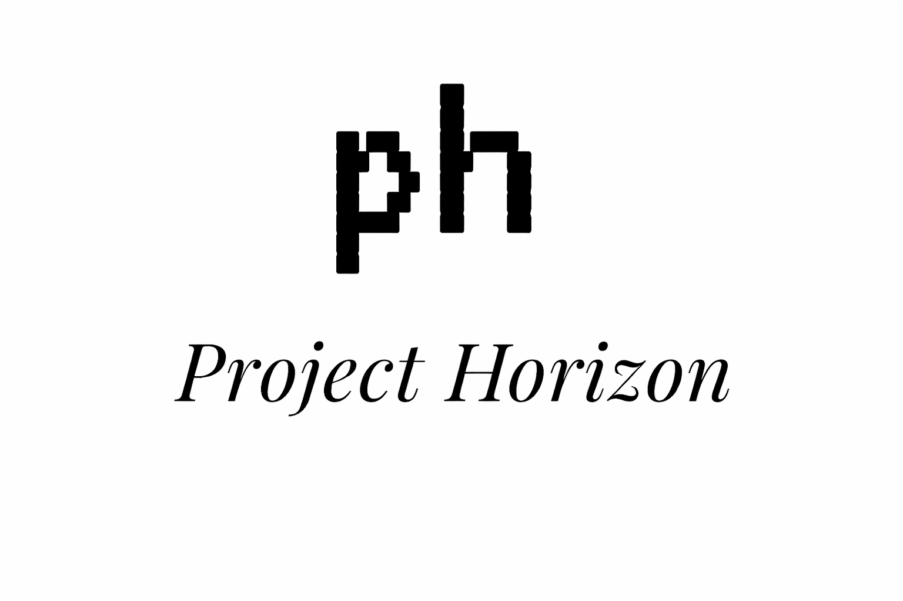

<div align="center">
  

  <br />

  <em>You can be anyone.</em>
  <br />

  <a href="https://youtu.be/Wcb6SSw7LFY">
    Demo
  </a>
</div>

---

## Project Horizon Tennis

Project Horizon Tennis turns an ordinary broadcast tennis clip — one static camera, no depth
sensor, no rig — into a navigable 3D scene. An offline Python pipeline solves the broadcast
camera from the court lines, tracks both players, lifts the scene into 3D with monocular depth,
and renders a first-person POV video from each player's head. A Viser viewer lets you fly a free
camera through the reconstruction, and a React web app plays the result back.

Everything is offline and per-match: you process a clip once, export it, and the web app reads
the exported files.

### How it works

| Stage | Command | What it does |
| --- | --- | --- |
| 1 | `init` | Import a raw broadcast clip (optionally trimmed and downscaled) as `source.mp4` |
| 2 | `calibrate` | Solve the broadcast camera from court keypoints you click once |
| 3 | `track` | Detect and track people with YOLO-seg + ByteTrack |
| 4 | `identify` | Name the near and far player (TwelveLabs Pegasus + Gemini, via Backboard) |
| 5 | `players` | Turn the tracks into per-frame court trajectories, speed and distance |
| 6 | `reconstruct` | Build the 3D point cloud (monocular depth) and the ground texture |
| 7 | `render` | Render each player's first-person POV video |
| 8 | `export` | Copy videos, manifest and tracks into `public/matches/<id>` for the web app |

`horizon all` runs all eight in order.

### Layout

```
pipeline/            Python package `horizon` — the offline reconstruction pipeline
  horizon/           Library modules and the `horizon <command>` CLI
  tests/             pytest suite
  data/<match-id>/   Per-match working artifacts (git-ignored)
  .env               Your API keys (git-ignored; copy from .env.example)
src/                 React web app (Vite + TypeScript)
public/matches/      Matches published by `horizon export` (git-ignored)
docs/                Design spec and implementation plan
```

## Requirements

- Python 3.11 (the pipeline supports `>=3.11,<3.13`)
- Node 24 / npm 11
- An NVIDIA GPU is strongly recommended — tracking, depth and rendering all run on CUDA when
  available, and fall back to CPU slowly. `horizon doctor` reports what it found.
- ffmpeg is not a separate install: it ships with `imageio-ffmpeg`.

## Setup

### Pipeline

```powershell
cd pipeline
py -3.11 -m venv .venv
.venv\Scripts\python -m pip install --upgrade pip
.venv\Scripts\python -m pip install -e ".[ml,viewer,dev]"
```

Then copy `pipeline\.env.example` to `pipeline\.env` and fill it in:

| Variable | Used for |
| --- | --- |
| `AWS_REGION`, `TWELVELABS_MODEL_ID` | TwelveLabs Pegasus on Amazon Bedrock (AWS credentials come from `aws configure` or `AWS_ACCESS_KEY_ID` / `AWS_SECRET_ACCESS_KEY`) |
| `OPENROUTER_API_KEY`, `GEMINI_MODEL_ID` | Gemini through OpenRouter |
| `BACKBOARD_API_KEY`, `BACKBOARD_LLM_PROVIDER`, `BACKBOARD_MODEL_NAME` | Backboard orchestration (leave provider and model empty for the assistant default) |

Only the `identify` stage needs these. Run `horizon identify --orchestrator none` to fall back to
court geometry and skip the model calls entirely.

Check the environment at any time:

```powershell
pipeline\.venv\Scripts\python -m horizon doctor
```

It prints the Python and ffmpeg versions, which optional packages are installed, whether CUDA is
available, which secrets are set (never their values) and the data root.

### Web app

```powershell
npm install
npm run dev
```

## Processing a match

The pipeline works on a **single static broadcast shot** — one continuous camera angle, no cuts.
Pick a rally or a game from behind the near baseline.

The whole pipeline in one command:

```powershell
cd pipeline
.venv\Scripts\python -m horizon all path\to\clip.mp4 --match-id wimbledon-final --start 0 --duration 30
```

Or one stage at a time, which is worth doing the first time so you can inspect each artifact:

```powershell
.venv\Scripts\python -m horizon init path\to\clip.mp4 --match-id wimbledon-final --start 0 --duration 30
.venv\Scripts\python -m horizon calibrate --match-id wimbledon-final
.venv\Scripts\python -m horizon track --match-id wimbledon-final
.venv\Scripts\python -m horizon identify --match-id wimbledon-final
.venv\Scripts\python -m horizon players --match-id wimbledon-final
.venv\Scripts\python -m horizon reconstruct --match-id wimbledon-final
.venv\Scripts\python -m horizon render --match-id wimbledon-final
.venv\Scripts\python -m horizon export --match-id wimbledon-final
```

A match id is 1–64 lowercase letters, digits or `-`. Every command takes `--help`.

### Calibration is interactive

`calibrate` is the one stage that needs you. It opens a frame and asks you to click named court
keypoints — the doubles and singles corners at each baseline, and the service line points.
"Left" and "right" are as seen from the broadcast camera behind the near baseline. Click as many
as are clearly visible; the solve uses the ones you provide, and writes
`calibration_preview.jpg` so you can check the court model lines up with the painted lines
before continuing.

To skip the clicking — in a script, or to reuse a solve — pass the points directly:

```powershell
.venv\Scripts\python -m horizon calibrate --match-id wimbledon-final --keypoints points.json
```

`--keypoints` takes a JSON object of `{name: [u, v]}`, or a previously written `calibration.json`.
`horizon all --recalibrate` forces the clicking step to run again.

### Artifacts

Each match writes to `pipeline/data/<match-id>/` (override the root with `HORIZON_DATA_ROOT`):

| File | Written by |
| --- | --- |
| `source.mp4`, `meta.json` | `init` |
| `calibration.json`, `calibration_preview.jpg` | `calibrate` |
| `detections.json` | `track` |
| `identity.json` | `identify` |
| `players.json` | `players` |
| `scene.npz`, `ground.png` | `reconstruct` |
| `pov_near.mp4`, `pov_far.mp4` | `render` |
| `free_cam.mp4` | the viewer's clip export |

`export` then copies the videos into `public/matches/<id>/` alongside a `manifest.json` and
`tracks.json`, and rewrites `public/matches/index.json` so the new match appears on the home page.

## The 3D free camera

```powershell
cd pipeline
.venv\Scripts\python -m horizon view --match-id wimbledon-final
```

Open the printed URL (http://localhost:8080 by default; `--host` and `--port` change it). The
viewer loads the point cloud, the ground texture and both players' trajectories, and gives you:

- **Frame** and **FPS** sliders to scrub and play the clip
- **Broadcast camera**, **Near player's eyes**, **Far player's eyes** — look through a known camera
- **Snap to near player** / **Snap to far player** — move the free camera onto that player's head pose
- **Follow** — keep the free camera locked to a player as the rally plays
- **FOV (horizontal)** — the free camera's field of view, in degrees
- **Look through free camera** — see the scene from the free camera's own pose
- **Render preview** — render a single frame from the free camera to check the framing
- **Export free-cam clip** — render the camera path to `free_cam.mp4`, frame-aligned with the
  broadcast clip, which the next `horizon export` publishes to the web app

Leave the viewer running while you use the web app: the exported manifest points the stream
page's free-camera panel at it.

## The web app

```powershell
npm run dev
```

The home page lists every match in `public/matches/index.json`. Opening one goes through a
processing animation to the stream page, which plays the broadcast video with:

- a tennis scoreboard built from the exported manifest
- a card for each player that tracks them across the video and shows live speed, distance and
  top speed from `tracks.json`
- click a card to expand that player's POV video
- a free-camera panel linking through to the Viser viewer

If a match is missing or its files fail to load, the page says so rather than showing stale data
from the previous match.

## Tests

```powershell
cd pipeline; .venv\Scripts\python -m pytest -q    # 85 tests
npm test                                          # 20 tests
npm run lint
npm run build
```

## Documentation

- `docs/superpowers/specs/2026-09-20-tennis-horizon-design.md` — the design spec
- `docs/superpowers/plans/2026-09-20-tennis-horizon.md` — the implementation plan
- `accessibility.md` — the web app's accessibility mode
